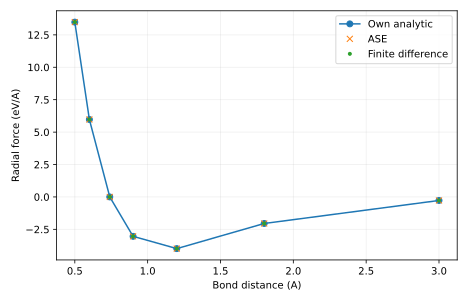

# 输出说明

本项目把 XYZ 中两个原子的坐标转换为距离、能量和两原子的力。我们用可手工求导的 Morse 势，建立以后优化、振动和动力学共同依赖的接口。

## 应先读什么、回答什么

scan.csv 对比能量和径向力；Cartesian-forces.csv 对比每帧两原子的完整力。除了看误差大小，还要解释为什么两原子力之和为零，以及旋转后哪些量不变、哪些量随坐标变化。

## 用于理解这些结果的背景

势能告诉我们哪个构型能量高，力告诉我们从当前构型向哪边移动会降低能量。对一根键，势能随键长变化；对真实多原子体系，能量依赖所有坐标，力是它对每个坐标的负导数。

[report.txt](report.txt) 给出运行模式、关键量及独立对照。以下文件保留可复算的中间数据：

- [report.txt](report.txt)
- [scan.csv](scan.csv)

CSV 的首行和 DAT 的首部注释给出列名、矩阵约定或单位；解释数值时请同时核对对应输入。

`result.json` 是附属审计记录：逐输入文件 SHA-256、实际源文件 SHA-256、启动版本、软件版本与 Slurm 作业号。若计算时工作树尚未提交，源文件哈希比 HEAD 更精确。

`legacy-result.json`、`legacy-inputs/` 和 previous-analysis.md 保留上一版记录。旧图若位于 legacy-figures/，只对应旧输入，不能当成当前主数据的图。

软件之间的一致性检验算法；它不自动验证模型适用、采样遍历性或 DFT 数值收敛。请按项目正文中的受控实验解释结论。

## 图与软件原始输出

[Cartesian-forces.csv](Cartesian-forces.csv) 给出逐帧、逐原子的坐标与自写/ASE 三分量力，单位 eV/Å。

[返回推导与受控实验](../README.md) · [核对输入](../input/README.md)
