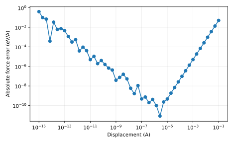

# Measured result and postmortem

Best sampled displacement: 2.68e-06 A; error 8.34e-12. The interior minimum confirms the prediction. Error at tiny h is cancellation, at large h truncation.

Input SHA-256: `3f4877326f7fab778194cf5f4f117a27dc6c882add71bb2d9e23846c1e6872a6`. Slurm job: `705307`. Software versions and source revision are in [result.json](result.json).

Predictions remain unchanged in the project README and root predictions.md. Numerical agreement validates the stated model and checks, not an unrestricted scientific claim.

