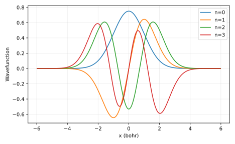

# Measured result and postmortem

Harmonic energies (Hartree): [0.49997201353277027, 1.4998600613964028, 2.4996361414533235, 3.4993002349572775]. Node counts: [0, 1, 2, 3]. Positive tunneling splitting: 0.067959 Hartree. The qualitative prediction holds; box size remains a separate convergence axis.

Input SHA-256: `904a30a39a53c4838d3480478bfd870e66a79cfbc7473cacd16581275eba04c7`. Slurm job: `705307`. Software versions and source revision are in [result.json](result.json).

Predictions remain unchanged in the project README and root predictions.md. Numerical agreement validates the stated model and checks, not an unrestricted scientific claim.

