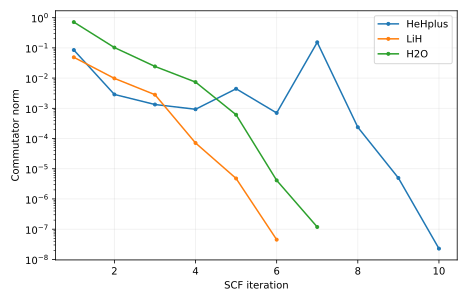

# 输出说明

本项目为给定核坐标和有限基组求闭壳层分子的 Hartree–Fock 基态近似。你将自己完成电子密度与平均场相互决定的 SCF 循环，并从同一物理输入独立运行 PySCF 核对。

## 应先读什么、回答什么

先用 H₂核对维度、核排斥和电子数，再用 LiH/水检查非平凡迭代。report.txt、D_initial.dat、D_final.dat、F_final.dat 和 iterations.csv 分别说明初猜是什么、自洽到了哪里、为什么停止。完成后应能从一张纸上的依赖关系解释每一次矩阵更新，而不仅是复现最终总能。

## 用于理解这些结果的背景

对于多电子分子，一个电子受到核的吸引，也受到其他电子的排斥。困难在于：其他电子在哪里，并不是事先给定的。完整多电子波函数依赖所有电子坐标，直接求解的代价很快增长。

[report.txt](report.txt) 给出运行模式、关键量及独立对照。以下文件保留可复算的中间数据：

- [H2/D_final.dat](H2/D_final.dat)
- [H2/D_initial.dat](H2/D_initial.dat)
- [H2/F_final.dat](H2/F_final.dat)
- [H2/Hcore.dat](H2/Hcore.dat)
- [H2/S.dat](H2/S.dat)
- [H2/X.dat](H2/X.dat)
- [H2/iterations.csv](H2/iterations.csv)
- [H2O/D_final.dat](H2O/D_final.dat)
- [H2O/D_initial.dat](H2O/D_initial.dat)
- [H2O/F_final.dat](H2O/F_final.dat)
- [H2O/Hcore.dat](H2O/Hcore.dat)
- [H2O/S.dat](H2O/S.dat)
- [H2O/X.dat](H2O/X.dat)
- [H2O/iterations.csv](H2O/iterations.csv)
- [HeHplus/D_final.dat](HeHplus/D_final.dat)
- [HeHplus/D_initial.dat](HeHplus/D_initial.dat)
- [HeHplus/F_final.dat](HeHplus/F_final.dat)
- [HeHplus/Hcore.dat](HeHplus/Hcore.dat)
- [HeHplus/S.dat](HeHplus/S.dat)
- [HeHplus/X.dat](HeHplus/X.dat)
- [HeHplus/iterations.csv](HeHplus/iterations.csv)
- [LiH/D_final.dat](LiH/D_final.dat)
- [LiH/D_initial.dat](LiH/D_initial.dat)
- [LiH/F_final.dat](LiH/F_final.dat)
- [LiH/Hcore.dat](LiH/Hcore.dat)
- [LiH/S.dat](LiH/S.dat)
- [LiH/X.dat](LiH/X.dat)
- [LiH/iterations.csv](LiH/iterations.csv)
- [report.txt](report.txt)

CSV 的首行和 DAT 的首部注释给出列名、矩阵约定或单位；解释数值时请同时核对对应输入。

`result.json` 是附属审计记录：逐输入文件 SHA-256、实际源文件 SHA-256、启动版本、软件版本与 Slurm 作业号。若计算时工作树尚未提交，源文件哈希比 HEAD 更精确。

`legacy-result.json`、`legacy-inputs/` 和 previous-analysis.md 保留上一版记录。旧图若位于 legacy-figures/，只对应旧输入，不能当成当前主数据的图。

软件之间的一致性检验算法；它不自动验证模型适用、采样遍历性或 DFT 数值收敛。请按项目正文中的受控实验解释结论。

## 图与软件原始输出

[返回推导与受控实验](../README.md) · [核对输入](../input/README.md)
