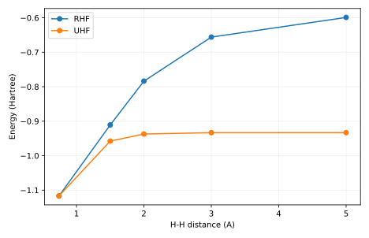

# 输出说明

本项目使用已经成熟的 RHF/UHF 求解器，分别改变键长、自旋约束和基组，学习判断一个数值收敛的电子结构结果在物理上是否可信。

## 应先读什么、回答什么

把 H₂ 拉伸能量与 S² 放在一起读，再分别检查 O₂ 自旋表和基组表。完成后应能指出某个差异属于初猜/驻点、表示空间还是波函数近似，并提出只改变一个因素的后续实验。

## 用于理解这些结果的背景

上一项验证了自己的 SCF 程序，但程序正确只保证它求解了指定近似。化学反应会改变成键方式；一个在平衡结构附近合理的近似，沿着断键路径可能逐渐失效。因此电子结构学习还需要主动设计能暴露近似的实验。

[report.txt](report.txt) 给出运行模式、关键量及独立对照。以下文件保留可复算的中间数据：

- [basis_sweep.csv](basis_sweep.csv)
- [oxygen.csv](oxygen.csv)
- [report.txt](report.txt)
- [stretch.csv](stretch.csv)

CSV 的首行和 DAT 的首部注释给出列名、矩阵约定或单位；解释数值时请同时核对对应输入。

`result.json` 是附属审计记录：逐输入文件 SHA-256、实际源文件 SHA-256、启动版本、软件版本与 Slurm 作业号。若计算时工作树尚未提交，源文件哈希比 HEAD 更精确。

`legacy-result.json`、`legacy-inputs/` 和 previous-analysis.md 保留上一版记录。旧图若位于 legacy-figures/，只对应旧输入，不能当成当前主数据的图。

软件之间的一致性检验算法；它不自动验证模型适用、采样遍历性或 DFT 数值收敛。请按项目正文中的受控实验解释结论。

## 图与软件原始输出

[返回推导与受控实验](../README.md) · [核对输入](../input/README.md)
