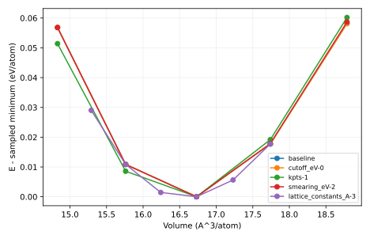

# Measured result and postmortem

Backend emt: fitted a0=3.995407 A; bulk modulus=34.969 GPa. These satisfy the predicted physical range. EMT values validate the fitting workflow only. Inspect the separate DFT output for electronic convergence.

Input SHA-256: `d72d5846ecdafb6dbd04f8320085478861970f24800b19b4c518bb76815c1583`. Slurm job: `705307`. Software versions and source revision are in [result.json](result.json).

Predictions remain unchanged in the project README and root predictions.md. Numerical agreement validates the stated model and checks, not an unrestricted scientific claim.

