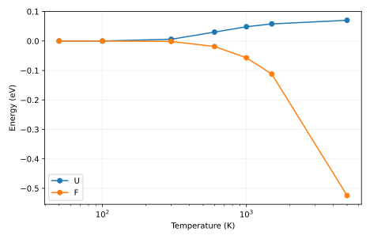

# 怎样阅读输出

[report.txt](report.txt) 给出运行模式、关键量及独立对照。以下文件保留可复算的中间数据：

- [oscillator.csv](oscillator.csv)
- [report.txt](report.txt)
- [two_level-0-populations.dat](two_level-0-populations.dat)
- [two_level-1-populations.dat](two_level-1-populations.dat)
- [two_level-2-populations.dat](two_level-2-populations.dat)
- [two_level-3-populations.dat](two_level-3-populations.dat)
- [two_level-4-populations.dat](two_level-4-populations.dat)
- [two_level-5-populations.dat](two_level-5-populations.dat)
- [two_level-6-populations.dat](two_level-6-populations.dat)
- [two_level.csv](two_level.csv)

CSV 第一行是列名；DAT 首部注释或项目 README 定义矩阵维度、指标和单位。自由能零点需要先对齐；虚频使用带符号表示，不取绝对值冒充稳定模式。

`result.json` 是附属审计记录：逐输入文件 SHA-256、实际源文件 SHA-256、启动版本、软件版本与 Slurm 作业号。若计算时工作树尚未提交，源文件哈希比 HEAD 更精确。

`legacy-result.json`、`legacy-inputs/` 和 previous-analysis.md 保留上一版记录。旧图若位于 legacy-figures/，只对应旧输入，不能当成当前主数据的图。

软件之间的一致性检验算法；它不自动验证模型适用、采样遍历性或 DFT 数值收敛。请按项目正文中的受控实验解释结论。

## 图与软件原始输出

