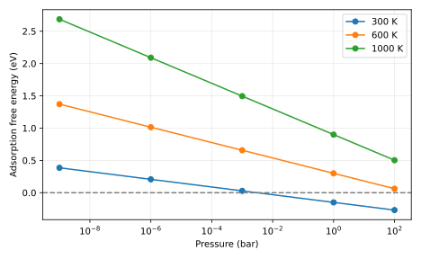

# Measured result and postmortem

The input has favorable electronic adsorption energy (-0.6 eV), but at 1000 K and 1 bar the model gives +0.9 eV free energy. The predicted sign reversal occurs because the gas entropy is lost. Constant entropy is a declared toy approximation.

Input SHA-256: `169a3d8d8f8fb4b7f80fc782c8f51e9a6054c55fb69958b2fd486bbe150f1a06`. Slurm job: `705307`. Software versions and source revision are in [result.json](result.json).

Predictions remain unchanged in the project README and root predictions.md. Numerical agreement validates the stated model and checks, not an unrestricted scientific claim.

