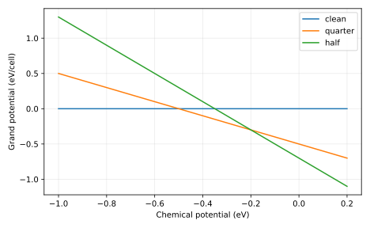

# Measured result and postmortem

The lower envelope follows clean → quarter → half coverage as chemical potential rises, with crossings at -0.5 and -0.2 eV. The prediction is confirmed for equal-area cells; configurational/vibrational surface entropy is omitted.

Input SHA-256: `05ac869e04f5d847b01d5378bf1a0eec670e3d79e7d434e5336b1daae2947438`. Slurm job: `705307`. Software versions and source revision are in [result.json](result.json).

Predictions remain unchanged in the project README and root predictions.md. Numerical agreement validates the stated model and checks, not an unrestricted scientific claim.

