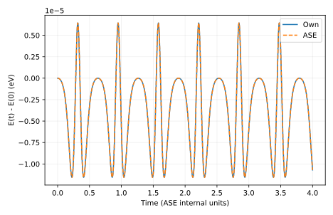

# 输出说明

本项目手写 Velocity Verlet 积分器，从坐标、质量和动量生成经典轨迹，并用守恒量与 ASE 的独立积分器检验时间推进。

## 应先读什么、回答什么

先读时间步长—能量误差表，再比较 own-Verlet.csv 与 ASE-Verlet.csv 的完整轨迹。完成后应能解释质量、动量和时间单位如何进入更新式，以及为什么同力接口的对照验证的是积分器而非势函数。

## 用于理解这些结果的背景

结构优化不断降低势能；无外界作用的经典动力学则让势能和动能互相转化，总能量守恒。给定势能面后，Newton 方程通过质量把力变成加速度，因此动力学输入还必须包含初始动量或速度。

[report.txt](report.txt) 给出运行模式、关键量及独立对照。以下文件保留可复算的中间数据：

- [ASE-Verlet.csv](ASE-Verlet.csv)
- [cluster.csv](cluster.csv)
- [final.extxyz](final.extxyz)
- [own-Verlet.csv](own-Verlet.csv)
- [report.txt](report.txt)
- [timestep_sweep.csv](timestep_sweep.csv)

CSV 的首行和 DAT 的首部注释给出列名、矩阵约定或单位；解释数值时请同时核对对应输入。

`result.json` 是附属审计记录：逐输入文件 SHA-256、实际源文件 SHA-256、启动版本、软件版本与 Slurm 作业号。若计算时工作树尚未提交，源文件哈希比 HEAD 更精确。

`legacy-result.json`、`legacy-inputs/` 和 previous-analysis.md 保留上一版记录。旧图若位于 legacy-figures/，只对应旧输入，不能当成当前主数据的图。

软件之间的一致性检验算法；它不自动验证模型适用、采样遍历性或 DFT 数值收敛。请按项目正文中的受控实验解释结论。

## 图与软件原始输出

[返回推导与受控实验](../README.md) · [核对输入](../input/README.md)
