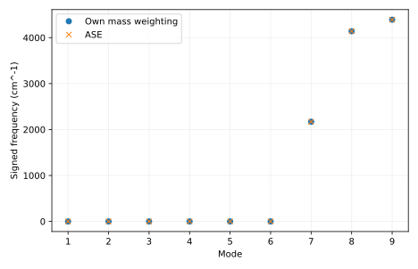

# 输出说明

本项目从真实水分子坐标和二阶导数矩阵得到正常振动，解释曲率如何判断结构稳定性，以及质量如何把曲率变成频率。

## 应先读什么、回答什么

先检查 mass_weighted_hessian.dat 的质量和坐标索引，再读 normal_modes.csv 的全谱与 ASE 差值，最后查看本征向量。完成后应能解释三个内部模式与六个近零模式的来源，并提出区分刚体误差和真实负曲率的检查。

## 用于理解这些结果的背景

最大力很小只说明一阶导数接近零。在山谷底部和山口鞍点，一阶导数都可能为零；区别在于向各方向轻推后，能量是升高还是降低。Hessian 是所有坐标二阶导数组成的矩阵，记录这种局部曲率与不同位移之间的耦合。

[report.txt](report.txt) 给出运行模式、关键量及独立对照。以下文件保留可复算的中间数据：

- [eigenvectors.dat](eigenvectors.dat)
- [mass_weighted_hessian.dat](mass_weighted_hessian.dat)
- [normal_modes.csv](normal_modes.csv)
- [report.txt](report.txt)

CSV 的首行和 DAT 的首部注释给出列名、矩阵约定或单位；解释数值时请同时核对对应输入。

`result.json` 是附属审计记录：逐输入文件 SHA-256、实际源文件 SHA-256、启动版本、软件版本与 Slurm 作业号。若计算时工作树尚未提交，源文件哈希比 HEAD 更精确。

`legacy-result.json`、`legacy-inputs/` 和 previous-analysis.md 保留上一版记录。旧图若位于 legacy-figures/，只对应旧输入，不能当成当前主数据的图。

软件之间的一致性检验算法；它不自动验证模型适用、采样遍历性或 DFT 数值收敛。请按项目正文中的受控实验解释结论。

## 图与软件原始输出

[返回推导与受控实验](../README.md) · [核对输入](../input/README.md)
