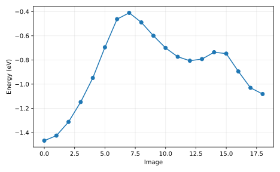

# 输出说明

本项目在两个已知稳定状态之间寻找最低能量路径，手写 NEB 的切线和力投影，并与 ASE 的路径优化比较。

## 应先读什么、回答什么

把路径坐标、image 间距、NEB 残余力和能量剖面一起读，再比较手写与 ASE 的势垒。完成后应能解释三种误差：路径尚未松弛、images 太稀、底层势能模型不适用。

## 用于理解这些结果的背景

知道反应物和产物的最低能结构，并不知道它们之间要经过多高的山口。直线插值只是连接端点的初始猜测，可能穿过强排斥区。普通结构优化又会把中间点都拉向附近极小值，无法自动保留整条连接路径。

[report.txt](report.txt) 给出运行模式、关键量及独立对照。以下文件保留可复算的中间数据：

- [ase-neb.txt](ase-neb.txt)
- [atomic/atomic-neb.txt](atomic/atomic-neb.txt)
- [atomic/fcc-opt.txt](atomic/fcc-opt.txt)
- [atomic/hcp-opt.txt](atomic/hcp-opt.txt)
- [atomic/image-00.extxyz](atomic/image-00.extxyz)
- [atomic/image-01.extxyz](atomic/image-01.extxyz)
- [atomic/image-02.extxyz](atomic/image-02.extxyz)
- [atomic/image-03.extxyz](atomic/image-03.extxyz)
- [atomic/image-04.extxyz](atomic/image-04.extxyz)
- [atomic/image-05.extxyz](atomic/image-05.extxyz)
- [atomic/image-06.extxyz](atomic/image-06.extxyz)
- [atomic/image-07.extxyz](atomic/image-07.extxyz)
- [atomic/image-08.extxyz](atomic/image-08.extxyz)
- [atomic-H_positions_A.csv](atomic-H_positions_A.csv)
- [atomic-endpoint_force_max.dat](atomic-endpoint_force_max.dat)
- [atomic-energies_eV.dat](atomic-energies_eV.dat)
- [own-band.csv](own-band.csv)
- [own-energies_eV.dat](own-energies_eV.dat)
- [own-path.csv](own-path.csv)
- [report.txt](report.txt)

CSV 的首行和 DAT 的首部注释给出列名、矩阵约定或单位；解释数值时请同时核对对应输入。

`result.json` 是附属审计记录：逐输入文件 SHA-256、实际源文件 SHA-256、启动版本、软件版本与 Slurm 作业号。若计算时工作树尚未提交，源文件哈希比 HEAD 更精确。

`legacy-result.json`、`legacy-inputs/` 和 previous-analysis.md 保留上一版记录。旧图若位于 legacy-figures/，只对应旧输入，不能当成当前主数据的图。

软件之间的一致性检验算法；它不自动验证模型适用、采样遍历性或 DFT 数值收敛。请按项目正文中的受控实验解释结论。

## 图与软件原始输出

[返回推导与受控实验](../README.md) · [核对输入](../input/README.md)
