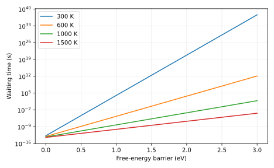

# Measured result and postmortem

At a 1 eV barrier, waiting times are 300 K: 1.008e+04 s, 1000 K: 5.26e-09 s. The prediction is confirmed under Eyring prefactor and transmission=1. These are conditional elementary waiting times.

Input SHA-256: `91f8f97e97dab385cd9d4d845ca3a6e470c5b78c4d5766f045d301b30a7972bc`. Slurm job: `705307`. Software versions and source revision are in [result.json](result.json).

Predictions remain unchanged in the project README and root predictions.md. Numerical agreement validates the stated model and checks, not an unrestricted scientific claim.

