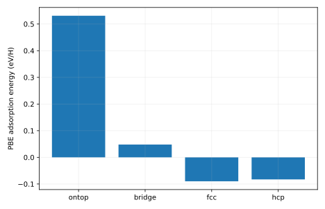

# 输出说明

本项目比较 H 在 Cu(111) 上的 atop、bridge、fcc 和 hcp 起始位点，把吸附能排序与优化后的真实结构、受力和数值误差联系起来。

## 应先读什么、回答什么

把能量表与最终结构对应起来读，再检查位点差相对于未解决误差的大小。完成后应能说明“哪个起点能量最低”和“哪个稳定吸附态最可靠”之间还需要哪些结构与收敛证据。

## 用于理解这些结果的背景

一个表面可提供多个局部成键环境：原子正上方、两原子之间、三重空位等。不同环境改变电子结构和几何松弛，形成不同的候选吸附态。比较位点是构建表面反应网络的前提，因为网络节点首先需要对应可辨认的物理状态。

[report.txt](report.txt) 给出运行模式、关键量及独立对照。以下文件保留可复算的中间数据：

- [bridge.extxyz](bridge.extxyz)
- [fcc.extxyz](fcc.extxyz)
- [hcp.extxyz](hcp.extxyz)
- [ontop.extxyz](ontop.extxyz)
- [report.txt](report.txt)
- [sites-0-final_H_position_A.dat](sites-0-final_H_position_A.dat)
- [sites-1-final_H_position_A.dat](sites-1-final_H_position_A.dat)
- [sites-2-final_H_position_A.dat](sites-2-final_H_position_A.dat)
- [sites-3-final_H_position_A.dat](sites-3-final_H_position_A.dat)
- [sites.csv](sites.csv)

CSV 的首行和 DAT 的首部注释给出列名、矩阵约定或单位；解释数值时请同时核对对应输入。

`result.json` 是附属审计记录：逐输入文件 SHA-256、实际源文件 SHA-256、启动版本、软件版本与 Slurm 作业号。若计算时工作树尚未提交，源文件哈希比 HEAD 更精确。

`legacy-result.json`、`legacy-inputs/` 和 previous-analysis.md 保留上一版记录。旧图若位于 legacy-figures/，只对应旧输入，不能当成当前主数据的图。

软件之间的一致性检验算法；它不自动验证模型适用、采样遍历性或 DFT 数值收敛。请按项目正文中的受控实验解释结论。

## 图与软件原始输出

### gpaw-source-logs

- [gpaw-source-logs/H2.txt](gpaw-source-logs/H2.txt)
- [gpaw-source-logs/bridge.txt](gpaw-source-logs/bridge.txt)
- [gpaw-source-logs/clean-opt.txt](gpaw-source-logs/clean-opt.txt)
- [gpaw-source-logs/clean.txt](gpaw-source-logs/clean.txt)
- [gpaw-source-logs/fcc-opt.txt](gpaw-source-logs/fcc-opt.txt)
- [gpaw-source-logs/fcc.txt](gpaw-source-logs/fcc.txt)
- [gpaw-source-logs/hcp.txt](gpaw-source-logs/hcp.txt)
- [gpaw-source-logs/ontop.txt](gpaw-source-logs/ontop.txt)

[返回推导与受控实验](../README.md) · [核对输入](../input/README.md)
