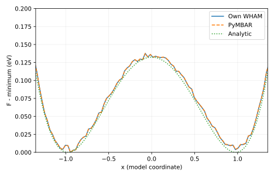
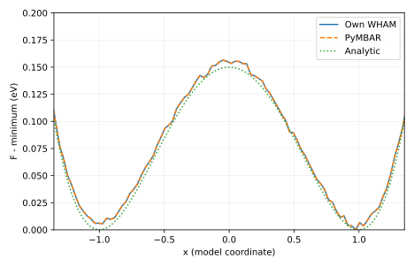

# 输出说明

本项目通过多个带偏置的采样窗口探索能垒区域，再去除已知偏置恢复平衡自由能，理解采样覆盖和重加权各自解决什么问题。

## 应先读什么、回答什么

先看 window-XX.csv 和重叠/隐藏变量诊断，再看 F-comparison.csv。只在采样充分区对齐自由能常数后比较形状。完成后应能区分窗口连接不足、分箱偏差和隐藏变量未平衡，且不把相邻采样点当独立样本来夸大精度。

## 用于理解这些结果的背景

高能区域的 Boltzmann 概率很小，普通采样可能几乎从不访问它。由未跨越能垒的短轨迹直接画直方图，会把“没采到”误认为“概率为零”。伞形采样用人为势把体系约束在不同窗口附近，让原本罕见的区域获得数据。

[report.txt](report.txt) 给出运行模式、关键量及独立对照。以下文件保留可复算的中间数据：

- [hidden_coordinate/F-comparison.csv](hidden_coordinate/F-comparison.csv)
- [hidden_coordinate/window-diagnostics.csv](hidden_coordinate/window-diagnostics.csv)
- [one_dimension/F-comparison.csv](one_dimension/F-comparison.csv)
- [one_dimension/window-diagnostics.csv](one_dimension/window-diagnostics.csv)
- [report.txt](report.txt)
- one_dimension/ 与 hidden_coordinate/ 下的 window-00.csv 至 window-12.csv 保存每个窗口的全部生产轨迹，列为 x_model,y_model。

CSV 的首行和 DAT 的首部注释给出列名、矩阵约定或单位；解释数值时请同时核对对应输入。

`result.json` 是附属审计记录：逐输入文件 SHA-256、实际源文件 SHA-256、启动版本、软件版本与 Slurm 作业号。若计算时工作树尚未提交，源文件哈希比 HEAD 更精确。

`legacy-result.json`、`legacy-inputs/` 和 previous-analysis.md 保留上一版记录。旧图若位于 legacy-figures/，只对应旧输入，不能当成当前主数据的图。

软件之间的一致性检验算法；它不自动验证模型适用、采样遍历性或 DFT 数值收敛。请按项目正文中的受控实验解释结论。

## 图与软件原始输出

[返回推导与受控实验](../README.md) · [核对输入](../input/README.md)
