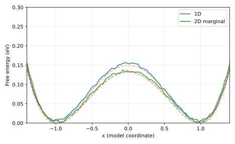

# Measured result and postmortem

WHAM profile shape RMSE: 1D 0.002249, 2D 0.00256 eV. Adjacent windows overlap and the predicted 0.03 eV criterion holds. Hidden-coordinate independent starts retain opposite means despite plausible x sampling. Histogram counts are correlated; this single-seed check is not a confidence interval.

Input SHA-256: `55f6e9b7e7ce38dc86a8e2b635b5e584acc07b46bb4f5016346932bfb7d014a1`. Slurm job: `705307`. Software versions and source revision are in [result.json](result.json).

Predictions remain unchanged in the project README and root predictions.md. Numerical agreement validates the stated model and checks, not an unrestricted scientific claim.

