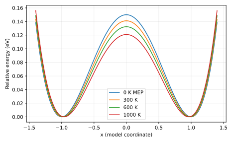

# Measured result and postmortem

0 K barrier: 0.15 eV. Finite-T barriers: 300 K: 0.141096 eV, 600 K: 0.132363 eV, 1000 K: 0.120929 eV. The predicted decrease follows transverse entropy. Experimental apparent activation additionally reflects coverage and the network, not just this marginal barrier.

Input SHA-256: `2b6240c94a7afbb1bd34ff68eb26d7a653ef887c4cbab2467c274b718212bf1b`. Slurm job: `705307`. Software versions and source revision are in [result.json](result.json).

Predictions remain unchanged in the project README and root predictions.md. Numerical agreement validates the stated model and checks, not an unrestricted scientific claim.

