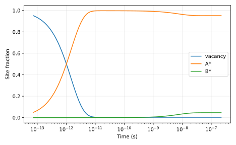

# Measured result and postmortem

Coverages [vacancy,A*,B*]: [0.0028750958995307527, 0.9514281779122002, 0.045696726188269074]; TOF=752321 s^-1; apparent activation=0.881787 eV. Direct and BDF solutions agree within 1e-8, confirming the prediction. There is one product, so selectivity is trivially 1; this is not a fitted experimental network.

Input SHA-256: `14861b98c4cef45239418427d39a2c4913f5474e8f9228994028df36d93426db`. Slurm job: `705307`. Software versions and source revision are in [result.json](result.json).

Predictions remain unchanged in the project README and root predictions.md. Numerical agreement validates the stated model and checks, not an unrestricted scientific claim.

