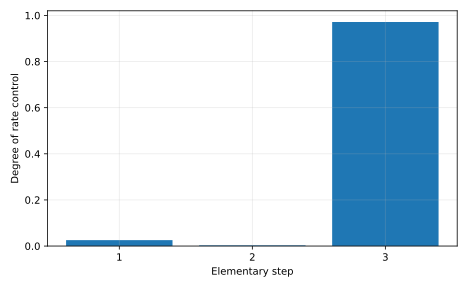

# Measured result and postmortem

Forward barriers [0.65, 0.8999999999999999, 0.55] eV have their maximum at step 2, but DRC values [0.025580892488804043, 0.002935318746581661, 0.9714838978981398] put the largest control on step 3. The counterexample prediction holds. Intermediate populations and reversibility invalidate simple isolated-barrier ranking.

Input SHA-256: `83d460173044bab3811898a1b17e60c10e90e6d4b3806f3143798826f6985909`. Slurm job: `705307`. Software versions and source revision are in [result.json](result.json).

Predictions remain unchanged in the project README and root predictions.md. Numerical agreement validates the stated model and checks, not an unrestricted scientific claim.

