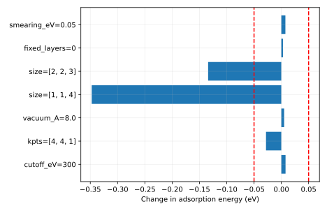

# 输出说明

本项目用真实 GPAW/PBE 数据检验一个具体的 H/Cu(111) 吸附假设，并保留从原生结构、软件日志到误差判断的完整证据。

## 应先读什么、回答什么

先读每个 case 的结构/参数与原始总能，再读收敛差值和结论。完成后应能独立复核报告，并将“接口已通”“几何已优化”“目标量已收敛”“物理模型适用”分别对应到实际证据。

## 用于理解这些结果的背景

前面在解析模型上可以用已知答案判断算法。真实材料没有这样的通用标准答案，需要用结构核对、独立参考、软件收敛和参数扫描逐层建立可信度。本项目把这些步骤合在同一个有限问题上，而不是把“调用 DFT 成功”作为终点。

[report.txt](report.txt) 给出运行模式、关键量及独立对照。以下文件保留可复算的中间数据：

- [baseline/fcc.extxyz](baseline/fcc.extxyz)
- [baseline-sites-0-final_H_position_A.dat](baseline-sites-0-final_H_position_A.dat)
- [baseline-sites.csv](baseline-sites.csv)
- [cutoff_eV-0/fcc.extxyz](cutoff_eV-0/fcc.extxyz)
- [fixed_layers-0/fcc.extxyz](fixed_layers-0/fcc.extxyz)
- [kpts-0/fcc.extxyz](kpts-0/fcc.extxyz)
- [report.txt](report.txt)
- [size-0/fcc.extxyz](size-0/fcc.extxyz)
- [size-1/fcc.extxyz](size-1/fcc.extxyz)
- [smearing_eV-0/fcc.extxyz](smearing_eV-0/fcc.extxyz)
- [sweep.csv](sweep.csv)
- [vacuum_A-0/fcc.extxyz](vacuum_A-0/fcc.extxyz)

CSV 的首行和 DAT 的首部注释给出列名、矩阵约定或单位；解释数值时请同时核对对应输入。

`result.json` 是附属审计记录：逐输入文件 SHA-256、实际源文件 SHA-256、启动版本、软件版本与 Slurm 作业号。若计算时工作树尚未提交，源文件哈希比 HEAD 更精确。

`legacy-result.json`、`legacy-inputs/` 和 previous-analysis.md 保留上一版记录。旧图若位于 legacy-figures/，只对应旧输入，不能当成当前主数据的图。

软件之间的一致性检验算法；它不自动验证模型适用、采样遍历性或 DFT 数值收敛。请按项目正文中的受控实验解释结论。

## 图与软件原始输出

### native-poscar-check

- [native-poscar-check/fcc-singlepoint-gpaw.txt](native-poscar-check/fcc-singlepoint-gpaw.txt)
- [native-poscar-check/fcc-singlepoint.extxyz](native-poscar-check/fcc-singlepoint.extxyz)
- [native-poscar-check/report.txt](native-poscar-check/report.txt)

### gpaw-source-logs

- [gpaw-source-logs/H2.txt](gpaw-source-logs/H2.txt)
- [gpaw-source-logs/clean-opt.txt](gpaw-source-logs/clean-opt.txt)
- [gpaw-source-logs/clean.txt](gpaw-source-logs/clean.txt)
- [gpaw-source-logs/fcc-opt.txt](gpaw-source-logs/fcc-opt.txt)
- [gpaw-source-logs/fcc.txt](gpaw-source-logs/fcc.txt)

[返回推导与受控实验](../README.md) · [核对输入](../input/README.md)
