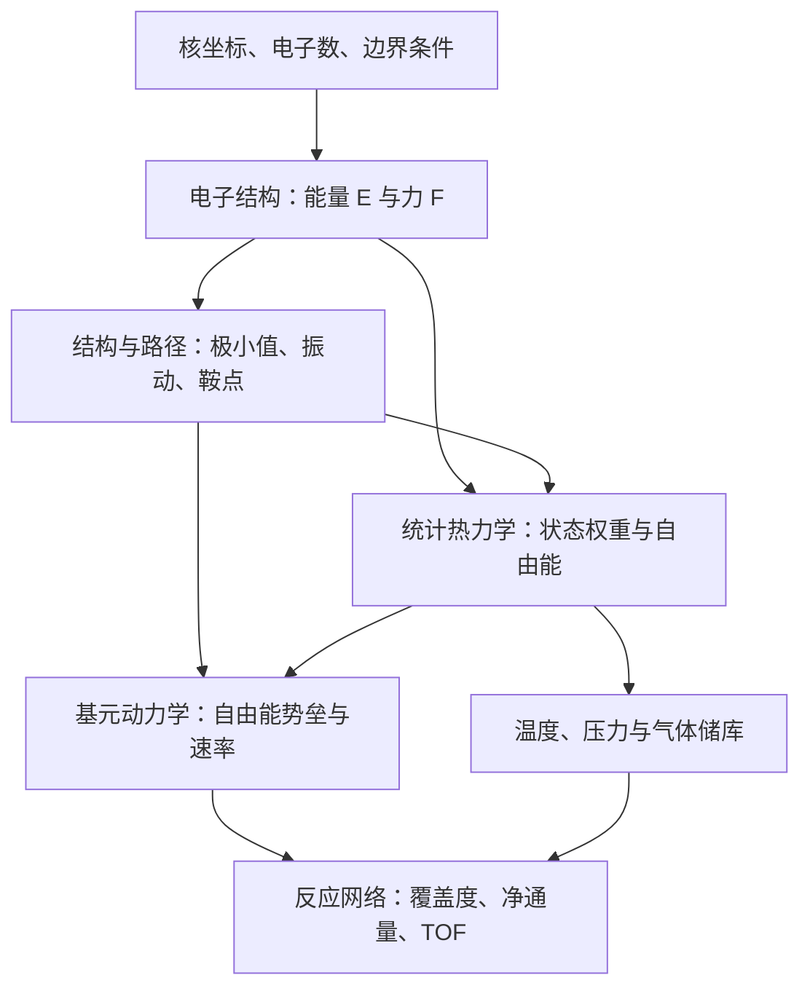

# From Electrons to Catalysis

这是一门通过编程与计算实验学习计算化学的课程：从原子核坐标定义电子问题，得到能量和力，再加入温度、反应路径与状态人口，逐步解释化学平衡和催化速率。目标是能说清每次计算为什么做、公式中的对象是什么，以及结果支持什么判断。

## 我们最终想理解什么

设想一个气体分子接近催化表面。它可能吸附到不同位点，转化成另一种物种，最后脱附。要解释这个过程，至少要回答：哪些状态存在、它们有多稳定、状态之间怎样转换、体系大部分时间待在哪里，以及每秒真正产生多少产物。

电子结构给出固定核坐标下的能量 E(R)，力是它的负梯度。热力学把可访问微观态的统计权重加入自由能；路径与过渡态描述跨越通道；微观动力学把单步速率和覆盖度耦合为周转频率 TOF。催化剂改变反应通道和达到平衡的速度，不改变给定反应与条件的平衡常数。



这些箭头表示需要传递的物理信息；课程中的小模型各自隔离一个环节。抽象网络的速率并非 H/Cu 的材料预测，解析势路径也并非真实 DFT 路径。真正连接不同计算时，要核对组成、标准态、温压和模型是否一致。

## 需要什么基础，从哪里开始

假定你会基本微积分、矩阵乘法和 Python 数组操作，尚未系统学过量子化学、统计力学或微观动力学。各项目先解释新概念和物理问题，再给公式、实际输入、实现步骤、输出与练习。

| 阶段 | 本阶段解决的疑问 | 读完应能做到 |
|---|---|---|
| [01 · 物理起点](01_intro/README.md) | 坐标定义了什么，计算做了哪些近似？ | 写出对象、假设与可否定的预测 |
| [02 · 单位和力](02_bringup/README.md) | 怎样建立可信的数值接口？ | 检查单位、导数方向和差分误差 |
| [03 · 电子结构](03_electronic_structure/README.md) | 波函数如何变成可求解问题？ | 从网格/LCAO 到自写 SCF，并识别近似失效 |
| [04 · 热力学](04_thermodynamics/README.md) | 温度、熵与气体压力如何改变稳定性？ | 从配分函数得到热化学和储库比较 |
| [05 · 动力学](05_kinetics/README.md) | 两个状态之间怎样变化、多快变化？ | 区分优化、MD、振动、NEB 与 TST |
| [06 · 催化](06_catalysis/README.md) | 为什么单步势垒不足以解释活性？ | 核对表面模型、自由能采样和耦合网络 |
| [07 · 真实体系](07_real_system/README.md) | 怎样让计算改变一个研究判断？ | 复核真实 DFT、定位误差并设计下一轮实验 |

第一次学习建议依次完成 [Hamiltonian](01_intro/01_hamiltonian/README.md)、[单位](02_bringup/01_units/README.md)、[能量与力](02_bringup/02_forces/README.md)、[网格薛定谔方程](03_electronic_structure/01_schrodinger/README.md) 和 [LCAO](03_electronic_structure/02_lcao/README.md)，再进入 RHF。已有电子结构基础可直接从 [四分子 RHF](03_electronic_structure/03_rhf/README.md) 开始。

分子热化学需要振动概念，可提前读 [Hessian 背景](05_kinetics/03_hessian/README.md)。最后的真实体系项目应按“备忘录 → 自己的新预测 → 计算 → 分析”使用，章节首页说明了这一顺序。

## 一个小例子如何走过整条链

H₂ 的 XYZ 给出 0.74 Å 核距，但并没有给出电子轨道。核排斥约 0.7151 Hartree 可先手算；RHF 则在有限基组中自洽求电子近似，得到包含核排斥的分子总能。改变核距会形成势能曲线，其导数给力，最低点附近曲率与质量决定振动。

加入振动和气体平移/转动统计后，才能讨论有限温自由能。另一个吸附模型中，电子吸附能为 −0.6 eV，却因 600 K 气体熵代价得到 +0.3 eV 的吸附自由能；动力学还需要势垒。即使知道一个基元速率，表面相应状态几乎无人占据时，也未必有可观测的催化通量。

因此每一层都增加了必要信息，而不是给同一个能量换名称。

## 每个项目怎样做

教学组织参考 [ProgrammingProjects](https://github.com/hn-yu/ProgrammingProjects)：从具体科学文件出发，分步推导，保存中间量，用渐进提示和独立核对完成理解。

1. 先读项目的背景、概念和小例子，用纸笔预测一个符号、数量级或变化趋势。
2. 查看 input/README.md，确认坐标、矩阵、能级或机制表分别定义什么；TOML 只放控制参数。
3. 按“实现边界”完成自己负责的核心，保留中间矩阵、轨迹或表格；成熟软件负责已明确交给它的部分。
4. 卡住时按顺序读 hints，完成后才与 run.py 和共享核心的参考实现对照。独立比较要保持同一物理输入，并说清检验了哪个环节。
5. 阅读 output/README.md，解释结果，再做正文的受控修改。提交自己的图/表与推理，保留原预测并追加实际测量。

每个项目包含正文、input、output、hints。书面项目使用明确案例与 answer.md；计算项目提供可执行参考和已运行输出。已有输出可帮助学习文件结构，新的受控实验仍需真实执行。

## 哪些应该自己写

| 学习对象 | 自己完成 | 成熟工具与独立核对 |
|---|---|---|
| 能量与力、LCAO、RHF | 导数、正交化、密度/Fock/能量/DIIS | ASE 势、SciPy 广义本征、PySCF RHF；积分直接由 PySCF 生成 |
| 振动、热化学 | Hessian 索引与质量加权、RRHO 分项 | PySCF 梯度/Hessian；ASE 模式与 IdealGasThermo |
| 优化、MD、NEB | 回溯、Verlet、切线与力投影 | SciPy BFGS、ASE VelocityVerlet/NEB |
| 自由能与反应网络 | WHAM、质量作用、详细平衡、速率控制 | PyMBAR FES、Cantera 原生 YAML 与表面动力学 |
| 分子/周期 DFT | 问题定义、参考态、收敛实验与结果解释 | 直接使用 PySCF、ASE/GPAW，不重写生产级电子结构软件 |

[逐项目实现边界](docs/IMPLEMENTATION_BOUNDARIES.md) 说明每次对照固定什么、检验什么。线性代数、结构读写、PAW、通用刚性求解器由成熟库提供；同一物理问题上自己实现的教学核心再与独立路径比较。

## 安装与运行

使用 Python 3.11+。完整安装和 GPAW 编译要求见 [INSTALL.md](INSTALL.md)。

```bash
python3 -m venv .venv
source .venv/bin/activate
python -m pip install -e '.[quantum,reference,test]'
```

在本 Slurm 集群上，计算与完整测试提交作业；按本机环境调整 scripts/slurm.sh 的分区与资源：

```bash
sbatch scripts/slurm.sh 03_electronic_structure/03_rhf/run.py --output runs/rhf
sbatch scripts/slurm.sh 03_electronic_structure/03_rhf/compare.py
sbatch scripts/slurm.sh 05_kinetics/03_hessian/run.py --output runs/vibrations
sbatch scripts/slurm.sh scripts/run_all.py --tiers core quantum periodic
sbatch scripts/slurm.sh -m pytest -q
```

`--input` 接收包含科学文件的**目录**，`--output` 指定新结果目录。输入使用 XYZ/EXTXYZ、CIF/POSCAR、DAT、CSV 与 Cantera YAML；TOML 只放控制参数。主输出是 report.txt、矩阵、轨迹、表格和软件原始日志，JSON 仅作附属审计记录。

DFT 项目默认分析仓库已执行的 PBE 数据。只有 `--calculate` 才调用 GPAW 进行新计算：

```bash
sbatch scripts/slurm.sh 03_electronic_structure/06_periodic/run.py --calculate --output runs/new-Al
sbatch scripts/slurm.sh 07_real_system/02_real_dft/run.py --calculate --output runs/new-H-Cu
```

学生先依据公式完成自己的实现，再使用 run.py 与共享核心作为参考解。每个 README 给出受控实验；hints 分步展开推导与排错。书面项目提供具体案例、公式和参考分析。

## 如何使用结果

算法一致与物理可信需要分别论证。自写 RHF 与 PySCF 一致不修复 RHF 的解离近似；WHAM 与 PyMBAR 一致不证明隐藏变量采样充分；GPAW 作业完成也不证明 slab 收敛。

真实 H/Cu 示例目前的三层与四层吸附能差约 0.35 eV，超过事先设定的 0.05 eV。它保留为一次失败的收敛假设，用于设计下一轮实验。旧输入、输出与预测保存在各项目 output 的历史文件中，新文档不改变历史预测的时间身份。

## 课程项目

| 项目 | 学习入口 |
|---|---|
| [01_intro/01_hamiltonian](01_intro/01_hamiltonian/README.md) | 01 · 从坐标写出电子—核 Hamiltonian |
| [01_intro/02_emulation](01_intro/02_emulation/README.md) | 02 · 用模拟器调通流程，再明确换模型 |
| [01_intro/03_prediction_log](01_intro/03_prediction_log/README.md) | 03 · 把预测写成可以被结果改变的判断 |
| [02_bringup/01_units](02_bringup/01_units/README.md) | 01 · 让单位在公式两边闭合 |
| [02_bringup/02_forces](02_bringup/02_forces/README.md) | 02 · 从两原子坐标到一致的能量和力 |
| [02_bringup/03_finite_differences](02_bringup/03_finite_differences/README.md) | 03 · 为什么更小的差分步长反而更差 |
| [03_electronic_structure/01_schrodinger](03_electronic_structure/01_schrodinger/README.md) | 01 · 从势能表组装薛定谔算符 |
| [03_electronic_structure/02_lcao](03_electronic_structure/02_lcao/README.md) | 02 · 非正交基组中的本征问题 |
| [03_electronic_structure/03_rhf](03_electronic_structure/03_rhf/README.md) | 从 AO 积分到 restricted Hartree–Fock：自己完成一次 SCF |
| [03_electronic_structure/04_break_hf](03_electronic_structure/04_break_hf/README.md) | 04 · 让 Hartree–Fock 暴露自己的近似 |
| [03_electronic_structure/05_dft](03_electronic_structure/05_dft/README.md) | 05 · 同一有限基组里的 HF、DFT 与 FCI |
| [03_electronic_structure/06_periodic](03_electronic_structure/06_periodic/README.md) | 06 · 周期边界、体积与状态方程 |
| [03_electronic_structure/07_checkpoint](03_electronic_structure/07_checkpoint/README.md) | 07 · 电子结构结果的四层核对 |
| [04_thermodynamics/01_partition](04_thermodynamics/01_partition/README.md) | 01 · 从能级表到自由能 |
| [04_thermodynamics/02_molecular_thermochemistry](04_thermodynamics/02_molecular_thermochemistry/README.md) | 02 · 从分子坐标到气相 Gibbs 自由能 |
| [04_thermodynamics/03_chemical_potential](04_thermodynamics/03_chemical_potential/README.md) | 03 · 压力通过化学势改变吸附方向 |
| [04_thermodynamics/04_surface_phase](04_thermodynamics/04_surface_phase/README.md) | 04 · 用巨势比较不同覆盖度 |
| [04_thermodynamics/05_checkpoint](04_thermodynamics/05_checkpoint/README.md) | 05 · 电子能、自由能与储库的检查点 |
| [05_kinetics/01_optimizer](05_kinetics/01_optimizer/README.md) | 01 · 优化的是驻点，还是你希望的结构 |
| [05_kinetics/02_dynamics](05_kinetics/02_dynamics/README.md) | 02 · 用能量误差检验 Velocity Verlet |
| [05_kinetics/03_hessian](05_kinetics/03_hessian/README.md) | 从 Cartesian Hessian 到正常振动：曲率、质量和虚频 |
| [05_kinetics/04_neb](05_kinetics/04_neb/README.md) | 04 · 把真实力与弹簧力放在正确方向 |
| [05_kinetics/05_tst](05_kinetics/05_tst/README.md) | 05 · 势垒如何变成时间尺度 |
| [05_kinetics/06_checkpoint](05_kinetics/06_checkpoint/README.md) | 06 · 从力到速率，哪一步证明了什么 |
| [06_catalysis/01_slab](06_catalysis/01_slab/README.md) | 01 · 收敛一个可解释的表面观测量 |
| [06_catalysis/02_adsorption](06_catalysis/02_adsorption/README.md) | 02 · 吸附位点竞争与参考态 |
| [06_catalysis/03_umbrella](06_catalysis/03_umbrella/README.md) | 03 · 从有偏轨迹恢复自由能 |
| [06_catalysis/04_mep_fes](06_catalysis/04_mep_fes/README.md) | 04 · 最低能量路径为什么不是自由能路径 |
| [06_catalysis/05_reaction_network](06_catalysis/05_reaction_network/README.md) | 05 · 从状态能量构造满足详细平衡的网络 |
| [06_catalysis/06_microkinetics](06_catalysis/06_microkinetics/README.md) | 06 · 覆盖度与基元速率共同决定 TOF |
| [06_catalysis/07_rate_control](06_catalysis/07_rate_control/README.md) | 07 · 用扰动代替“最高势垒就是决速步”的直觉 |
| [06_catalysis/08_checkpoint](06_catalysis/08_checkpoint/README.md) | 08 · 从一个势垒到催化观测量 |
| [07_real_system/01_calculation_memo](07_real_system/01_calculation_memo/README.md) | 01 · 先写计算备忘录，再申请资源 |
| [07_real_system/02_real_dft](07_real_system/02_real_dft/README.md) | 02 · 用真实 PBE 计算回答一个有限问题 |
| [07_real_system/03_blind_prediction](07_real_system/03_blind_prediction/README.md) | 03 · 保留真正的事前与事后记录 |
| [07_real_system/04_bringup_analysis](07_real_system/04_bringup_analysis/README.md) | 04 · 失败的收敛假设怎样产生下一步 |
| [07_real_system/05_advisor_defense](07_real_system/05_advisor_defense/README.md) | 05 · 对“算一个 NEB 就证明迁移”进行答辩 |

[原课程大纲](COURSE_OUTLINE.md) · [实现边界](docs/IMPLEMENTATION_BOUNDARIES.md) · [安装说明](INSTALL.md)
